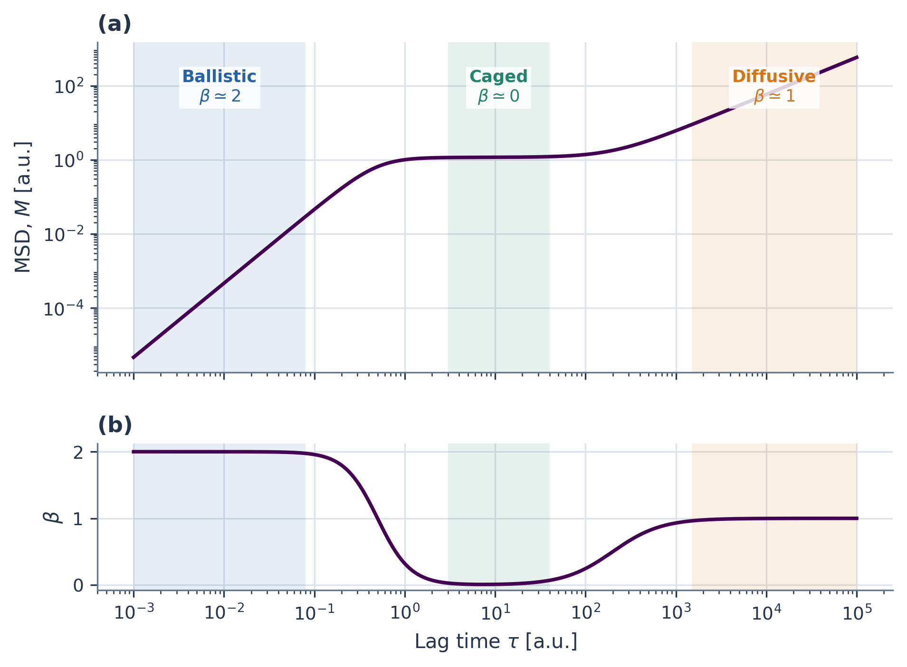
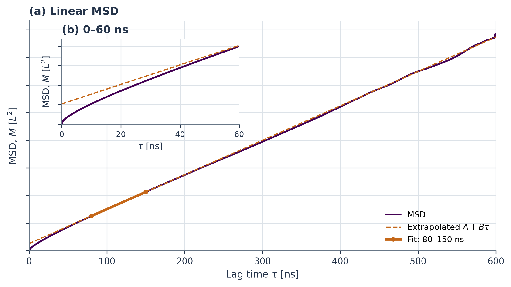
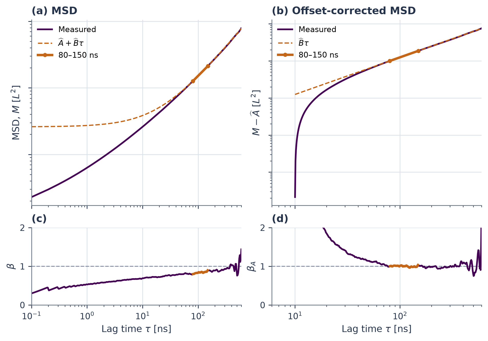
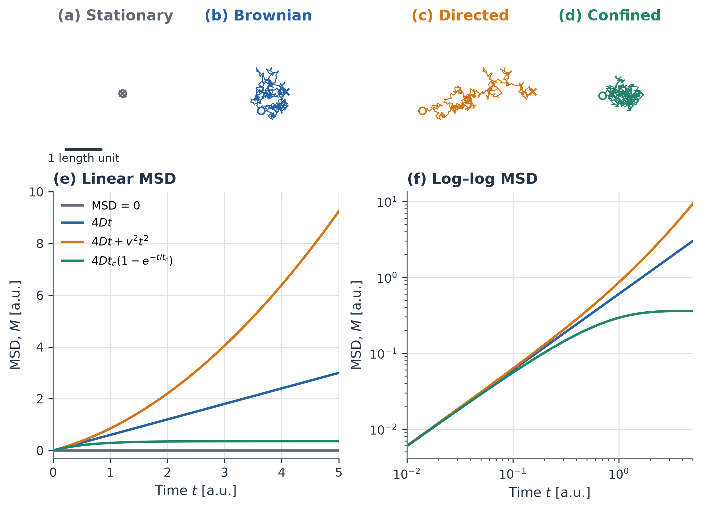

# Mean-squared displacement analysis: From molecular trajectories to diffusion

## Contents

1. [Introduction](#1-introduction)
2. [Preparing MSD data](#2-preparing-msd-data)
3. [Applying the MSD analysis](#3-applying-the-msd-analysis)
4. [Choosing a diffusion window](#4-choosing-a-diffusion-window)
5. [Estimating diffusion and checking reliability](#5-estimating-diffusion-and-checking-reliability)
6. [Practical workflow](#6-practical-workflow)
7. [Appendix A: MSD estimator and algorithms](#appendix-a-msd-estimator-and-algorithms)
8. [Appendix B: Preparing equilibrium trajectories](#appendix-b-preparing-equilibrium-trajectories)
9. [Appendix C: Synthetic motion patterns](#appendix-c-synthetic-motion-patterns)
10. [References](#references)

---

## 1. Introduction

The mean-squared displacement (MSD) connects particle motion to long-time spreading:

$$
M(t)=\left\langle
|\mathbf{r}(t_0+t)-\mathbf{r}(t_0)|^2
\right\rangle.
\tag{1}
$$

Here $t$ is the lag time, $t_0$ is its starting time, and the brackets denote an ensemble average, commonly estimated by averaging over time origins for stationary dynamics. This tutorial focuses on selecting and validating a diffusion window from a pre-computed MSD; [Section 2](#2-preparing-msd-data) summarizes how such data can be obtained, with calculation and trajectory-preparation details deferred to [Appendix A](#appendix-a-msd-estimator-and-algorithms) and [Appendix B](#appendix-b-preparing-equilibrium-trajectories).

For drift-free isotropic diffusion in three dimensions, Einstein's relation is

$$
M(t)=6Dt,
\tag{2}
$$

where $D$ has units of length squared per time.<sup>[1]</sup> A directional MSD instead has slope $2D_x$, and anisotropic systems should be analyzed by component rather than assigned a single shared diffusion coefficient.

Equation (2) is a long-time limit. At short lag times, velocity persistence can produce ballistic growth, $M(t)\propto t^2$; repeated reversals can then produce a caged interval, whereas ordinary diffusion has $M(t)\propto t$.<sup>[2,3]</sup> Figure 1 summarizes these possible regions of a single MSD curve.

The local logarithmic slope $\beta(t)=\mathrm{d}\log M/\mathrm{d}\log t$ is useful for distinguishing them: it is near two for ballistic motion, may fall toward zero during caging, and approaches one for ordinary diffusion. Persistent $0<\beta<1$ or $\beta>1$ describes subdiffusive or superdiffusive growth, respectively, but the observed exponent does not identify a unique mechanism and a short apparent power law may be only a crossover.<sup>[4,5]</sup>



**Figure 1. MSD regimes.** (a) A single smooth MSD curve showing different lag-time regions within one trajectory. (b) Its local logarithmic slope, $\beta(t)=\mathrm{d}\ln M/\mathrm{d}\ln t$. Shaded bands mark representative ballistic, caged, and diffusive lag-time regions; the unshaded intervals are crossovers. These regions belong to one trajectory and are not separate motion patterns. The curve is a schematic rather than a fit to the trajectory analyzed below, and not every system displays all three regions.

A further complication is that a linear long-time MSD need not extrapolate through the origin. For a normalized displacement probability density $p(\mathbf{r},t)$, Fick's equation gives

$$
\frac{\partial p}{\partial t}=D\nabla^2 p,
\qquad
M(t)=\int |\mathbf{r}|^2 p(\mathbf{r},t)\,\mathrm{d}^3r.
\tag{3}
$$

When the boundary terms vanish, integration by parts yields

$$
\frac{\mathrm{d}M}{\mathrm{d}t}
=D\int p\,\nabla^2|\mathbf{r}|^2\,\mathrm{d}^3r
=6D.
\tag{4}
$$

If this constant slope applies only after a crossover time $t_c$, then

$$
M(t)=M(t_c)+6D(t-t_c)=A+6Dt,
\qquad
A=M(t_c)-6Dt_c.
\tag{5}
$$

Thus $A$ is the extrapolated intercept of the late-time line, not the true MSD at $t=0$.

The same result follows from the velocity autocorrelation $C_v(s)=\langle\mathbf{v}(t_0+s)\cdot\mathbf{v}(t_0)\rangle$:

$$
M(t)=2\int_0^t(t-s)C_v(s)\,\mathrm{d}s.
\tag{6}
$$

If the velocity correlations decay sufficiently rapidly, the long-time form is

$$
M(t)\simeq 6Dt+A,
\qquad
D=\frac{1}{3}\int_0^\infty C_v(s)\,\mathrm{d}s,
\qquad
A=-2\int_0^\infty s C_v(s)\,\mathrm{d}s.
\tag{7}
$$

Short-time velocity memory can therefore contribute a constant to the late-time MSD while leaving its slope unchanged; finite-sampling and measurement effects may also contribute to the fitted intercept. Accordingly, the analysis below fits a free intercept, identifies a sustained linear window, and checks the stability and statistical adequacy of the resulting diffusion estimate. The paper by Bullerjahn, von Bülow, and Hummer provides the statistical benchmark for handling correlated, unequally precise MSD data and for quantifying uncertainty and goodness of fit.<sup>[6]</sup> This tutorial first uses slope, intercept, and window-stability diagnostics, then points to their framework for rigorous validation.

---

## 2. Preparing MSD data

The subsequent analysis requires a pre-computed series of lag times $\tau_k$ and corresponding MSD values $\widehat{M}_k$. There are two general, software-independent routes for producing this input.

For reproducibility, record the ensemble conditions, system size, thermostat and barostat settings, sampling interval, production length, and treatment of drift and periodic boundaries. Retain independent runs or blocks for uncertainty estimation and state any finite-size correction, following the best-practice recommendations of Maginn et al.<sup>[7]</sup>

An MSD may be accumulated on the fly during a simulation, without storing the complete coordinate history. Before starting such a simulation, carefully verify the particle selection, reference frame, spatial components, treatment of periodic boundaries and drift, use of multiple time origins, and normalization at each lag. These choices define the observable and cannot be recovered from the final MSD curve alone. [Appendix B](#appendix-b-preparing-equilibrium-trajectories) illustrates these requirements with a representative simulation setup.

Alternatively, save the trajectory and calculate the MSD after the simulation. Coordinates must be unwrapped consistently before computing displacements; particle identities and the box information needed for unwrapping must therefore be retained. Post-processing makes it easier to change selections, reference frames, and lag ranges, but requires sufficient coordinate output and storage. [Appendix A](#appendix-a-msd-estimator-and-algorithms) defines the estimator and its direct and FFT evaluations.

Once a correctly defined and documented MSD has been obtained by either route, the subsequent diffusion analysis can proceed.

> **CLI tip.** The companion tool `msd_check.py` expects exactly this two-column input (`lag_time`, `MSD`), as produced by LAMMPS `compute msd` (total column) or by post-processing packages.

---

## 3. Applying the MSD analysis

Figure 2 shows a pre-computed MSD from a 600 ns record with frames saved every 0.1 ns. The example illustrates how the curve, enlargement, and candidate fit should be interpreted; its displayed range and 80–150 ns fit do not by themselves establish a validated diffusion window.



**Figure 2. Linear-axis MSD.** (a) The measured MSD (purple), with the linear fit $A+B\tau$ over 80–150 ns (solid orange). The endpoints mark the fitting interval; the dashed orange line extends the same fit. (b) The same MSD over 0–60 ns and the extrapolated fitting line from (a), not a separate short-lag fit. Both axes remain linear. The main curve uses a reduced display density; the enlargement retains every sampled lag. The fit uses all sampled lags within 80–150 ns, before display thinning. Lag time is shown in ns and the MSD ordinate indicates its dimension $L^2$; numerical fit coefficients are not displayed.

Lag time $\tau$ is the separation between observations, not absolute simulation time. The 0.1 ns saved-frame spacing sets the shortest nonzero lag, not the MD integration timestep. The MSD uses every available starting frame, but overlapping displacements are correlated; at the longest lag of 600 ns, only one start–end pair per ion remains. The 80–150 ns fitting window is a separate choice from both the full record and the 0–60 ns enlargement, which changes only the display.

These sampling properties determine how the data should be interpreted. The next step is to decide which part, if any, supports a diffusion estimate.

---

## 4. Choosing a diffusion window

A candidate diffusive interval should show a sustained, approximately constant positive linear slope after early relaxation and before the poorly sampled tail. On linear axes, define

$$
s(t)=\frac{\mathrm{d}M}{\mathrm{d}t},
\qquad [s]=L^2 T^{-1}.
\tag{8}
$$

For three-dimensional isotropic diffusion, $s=6D$. A candidate window should therefore have little systematic variation in $s(t)$ and should give a similar fitted slope when its boundaries are moved.

The logarithmic slope

$$
\beta(t)=\frac{\mathrm{d}\log M}{\mathrm{d}\log t}
=\frac{t}{M(t)}\frac{\mathrm{d}M}{\mathrm{d}t},
\qquad t>0,\quad M(t)>0.
\tag{9}
$$

is useful for identifying the motion regimes in [Section 1](#1-introduction), but it does not measure the magnitude of $D$. A constant $\beta$ also does not guarantee a constant linear slope; for example, ballistic motion has $\beta=2$ and $s(t)\propto t$.

A linear diffusive interval need not have $\beta=1$ if its MSD has an offset. For $M(\tau)\simeq A+B\tau$ with $B=6D>0$,

$$
\beta(\tau)\simeq\frac{B\tau}{A+B\tau},
\qquad A+B\tau>0.
\tag{10}
$$

A positive offset gives $\beta<1$, and a negative offset gives $\beta>1$, even though $B$ is constant. The logarithmic slope approaches one only when $B\tau\gg|A|$. The offset may reflect velocity memory or finite-data and measurement effects; [Section 1](#1-introduction) gives its physical interpretation. Fit the intercept rather than force the line through the origin.

As a consistency check, use the fixed fitted intercept to inspect the corrected measured MSD, $\widehat{M}_k-\widehat{A}$. Within the same candidate window it should track $\widehat{B}\tau$, and its logarithmic slope should be near one. Because $\widehat{A}$ comes from the same data, this is a consistency check rather than independent evidence of diffusion.

Figure 3 applies this check to the 80–150 ns fit in Figure 2.



**Figure 3. Logarithmic MSD and slopes.** (a) Measured MSD on log–log axes and the linear fit $\widehat{A}+\widehat{B}\tau$ from 80–150 ns. (b) The same measured MSD minus the fitted intercept $\widehat{A}$, compared with $\widehat{B}\tau$; no refitting is performed. (c) The logarithmic slope $\beta$ of the measured curve in (a). (d) The logarithmic slope $\beta_A$ of the corrected curve in (b). Orange marks the 80–150 ns interval; dashed orange lines extend the fit, and horizontal gray lines mark unit slope. Slopes use finite differences on a uniformly log-spaced interpolation, without smoothing. Agreement after offset subtraction is a consistency check, not independent validation of diffusion.

Choose the candidate window from a sustained linear slope and stability under nearby window choices, not by requiring the raw logarithmic slope to equal one. [Section 5](#5-estimating-diffusion-and-checking-reliability) points to the remaining residual and uncertainty checks.

---

## 5. Estimating diffusion and checking reliability

After selecting a candidate interval as in [Section 4](#4-choosing-a-diffusion-window), fit $\widehat{M}_k\simeq\widehat{A}+\widehat{B}\tau_k$ and use $\widehat{D}=\widehat{B}/6$ as a point estimate; inspect the residuals and vary both window boundaries to check that the result is stable. The usual ordinary least-squares standard error is not a reliable uncertainty for $D$, because MSD values at different lags are strongly correlated and have unequal uncertainties. For a rigorous statistical treatment, see Bullerjahn *et al.*, whose covariance-aware generalized least-squares framework provides both a diffusion estimate and its uncertainty, while temporal sub-sampling and a $\chi^2$-based goodness-of-fit statistic test when a coarse-grained diffusion model becomes statistically adequate.<sup>[6]</sup> These procedures assess uncertainty and model adequacy rather than select the 80–150 ns candidate window. Report the particle population, reference frame, units, observation duration, frame spacing, fitting window, fitting model, and uncertainty method alongside any final value of $\widehat{D}$.

---

## 6. Practical workflow

The considerations discussed above can be translated into a simple practical workflow for extracting diffusion coefficients from molecular dynamics trajectories in a consistent and reproducible manner. MSDs can be calculated using packages such as `freud-analysis`,<sup>[8]</sup> `TRAVIS`,<sup>[9]</sup> or `TAME`.<sup>[10]</sup> Regardless of the software used, the physical interpretation and extraction of diffusion coefficients should follow the same general procedure.

Before reporting a diffusion coefficient, the following workflow is recommended:

- [ ] **Prepare the trajectory.** Use equilibrated production data, unwrap coordinates across periodic boundaries, and define the particle selection and reference frame appropriate to the transport process of interest.

- [ ] **Calculate the MSD.** Compute the time-origin-averaged MSD over the accessible range of lag times, using a sufficient number of time origins to obtain adequate statistical averaging.

- [ ] **Identify the dynamical regime.** Inspect the MSD on log–log axes and evaluate the local logarithmic slope
  $$
  \beta(\tau)=\frac{d\log M(\tau)}{d\log\tau}.
  $$
  This diagnostic helps distinguish short-time ballistic, caged, subdiffusive, and crossover behavior from a candidate long-time diffusive regime. The value of $\beta(\tau)$ should be used as a diagnostic of the dynamical regime rather than as the sole criterion for selecting the fitting interval.

- [ ] **Fit the diffusive window.** On linear axes, identify a sustained interval over which the MSD is well described by a linear function of lag time and fit
  $$
  M(\tau)=A+B\tau.
  $$
  For three-dimensional isotropic diffusion,
  $$
  D=\frac{B}{6}.
  $$

- [ ] **Validate the fitted regime.** Confirm that the fitted linear relation provides a consistent description of the MSD over the selected interval. As an additional check, examine the offset-corrected MSD,
  $$
  M(\tau)-A,
  $$
  which should be approximately proportional to $\tau$ over the same interval, with a local logarithmic slope close to unity. In addition, perturb the lower and upper bounds of the fitting window and verify that the fitted slope $B$, and hence $D$, remains stable within the statistical uncertainty.

This workflow deliberately separates the identification of the long-time diffusive regime from the final estimation of the diffusion coefficient. The log–log analysis is used to diagnose the underlying dynamical behavior, whereas the diffusion coefficient is obtained from a direct linear fit to the MSD on linear axes. The offset-corrected MSD and fitting-window sensitivity then provide complementary consistency checks before the final value of $D$ is reported.

**One-click CLI.** With a two-column MSD file ready, run:

```bash
python msd_check.py examples/msd.dat --window 80 150
```

See [README.md](README.md) for options.

---

## Appendix A: MSD estimator and algorithms

With a particle selection and reference frame specified, direct averaging and the FFT method evaluate the same time-origin-averaged MSD estimator. They differ in computational cost, not in the information extracted from a trajectory.

### Direct averaging

For $N$ positions stored at spacing $\delta t$, the ensemble MSD is estimated by averaging over every available starting frame:

$$
\widehat{M}_k=\frac{1}{N-k}\sum_{n=0}^{N-k-1}
|\mathbf{r}_{n+k}-\mathbf{r}_n|^2,
\qquad
\tau_k=k\delta t,\quad 1\leq k<N.
\tag{A1}
$$

For several equivalent particles, their squared displacements are averaged, not their positions. Periodic coordinates are unwrapped consistently before forming displacements as wrapped coordinates can create false jumps or artificial saturation.

Computing every lag costs $O(PN^2)$ for $P$ particles; while computing only $L$ short lags costs $O(PNL)$. A loop needs no quadratic displacement array: processing one particle at a time uses $O(N)$ working memory, apart from stored input. Therefore, direct averaging is practical for short records or a small lag set, but expensive for all lags of a long trajectory.

At large lags, few starting frames remain. Moreover, overlapping displacements are correlated: $N-k$ origins are not $N-k$ independent measurements. Faster computation cannot remove this sampling limit.

### FFT evaluation

The FFT method evaluates the same estimator more efficiently by expressing the repeated products as an autocorrelation. For one coordinate, expanding $(x_{n+k}-x_n)^2=x_{n+k}^2+x_n^2-2x_n x_{n+k}$ gives

$$
\widehat{M}_k^{(x)}=
\frac{S_{N-k}+S_N-S_k-2C_k}{N-k},
\quad
S_j=\sum_{n=0}^{j-1}x_n^2,
\quad
C_k=\sum_{n=0}^{N-k-1}x_n x_{n+k}.
\tag{A2}
$$

Here $S_0=0$. Cumulative sums give $S_j$; an inverse FFT of the squared Fourier magnitude gives $C_k$ with the usual inverse-transform normalization. Add the three coordinate contributions to recover Eq. (A1).<sup>[11]</sup>

Zero-pad to at least $2N-1$ samples to avoid circular correlation, and retain the $N-k$ normalization. For equally spaced frames this reduces the full cost to $O(PN\log N)$, with $O(N)$ working memory when processing one particle and coordinate at a time. This changes neither the estimator nor its statistical uncertainty.

Subtracting a fixed coordinate offset can reduce cancellation between large terms without changing displacements. Verify the implementation against direct averaging on a short record, including large lags and a translated copy of the coordinates. Do not hide numerical failures by clipping negative results.

---

## Appendix B: Preparing equilibrium trajectories

Before applying the MSD estimator, establish that the trajectory samples the intended physical state. Assume that the interaction model, particle masses, initial positions and velocities, and simulation box have been defined. The remaining choices are the ensemble, integration timestep, temperature and pressure controls, and sampling interval.

Specify the boundary conditions and the numerical settings of the interaction model, including cutoffs and any long-range accuracy requirements. Choose the target temperature $T_{\mathrm{target}}$ and, for NPT sampling, the target pressure $P_{\mathrm{target}}$. Pressure control also requires a choice of which box dimensions may change. All parameters must use the same unit convention as the model.<sup>[12]</sup>

The integration timestep $\Delta t$ sets the time resolution of the dynamics. The thermostat and barostat damping times, $\tau_T$ and $\tau_P$, set their respective coupling time scales; they are not numbers of timesteps. Their choices must be checked for numerical stability and sensitivity of the inferred dynamics, rather than copied from another system.<sup>[13,14]</sup>

Exclude equilibration from the MSD average and retain uniformly spaced production frames at interval $\delta t$, distinct from $\Delta t$. Positions, box vectors, and particle identities must permit consistent periodic unwrapping. Assess sampling through the stability and uncertainty of the diffusion estimate, not a prescribed duration. The selected particles and reference frame also define the observable: atomic motion, molecular center-of-mass motion, and motion relative to the system center of mass answer different questions. Choose them for the intended transport process, not to make the MSD appear linear.

### LAMMPS implementation

The `temp/csvr` fix implements the Bussi–Donadio–Parrinello thermostat.<sup>[13]</sup> For pressure control, it can be paired with `fix nph`. LAMMPS uses the Shinoda formulation, combining Martyna–Tobias–Klein hydrostatic equations with Parrinello–Rahman strain energy; this is not a literal implementation of the original Parrinello–Rahman equations.<sup>[14]</sup>

The following parameter block assumes an already defined, three-dimensional periodic system with nonzero thermal velocities. The variables `dt`, `Ttarget`, `Ptarget`, `Tdamp`, `Pdamp`, and `seed` must have values assigned in the chosen unit convention. They represent $\Delta t$, $T_{\mathrm{target}}$, $P_{\mathrm{target}}$, $\tau_T$, $\tau_P$, and a positive integer random seed, respectively. No material-specific values are implied. The CSVR fix requires LAMMPS's EXTRA-FIX package.<sup>[13]</sup>

```lammps
# LAMMPS — Temperature and pressure control
timestep ${dt}
fix thermal all temp/csvr ${Ttarget} ${Ttarget} ${Tdamp} ${seed}
fix pressure all nph iso ${Ptarget} ${Ptarget} ${Pdamp} &
    ptemp ${Ttarget} mtk yes pchain 0
```

Here `iso` couples the box lengths under a common pressure; it does not allow independent shear deformation. A fully flexible cell instead uses `tri` with a triclinic box. The `ptemp` setting supplies the reference temperature for the barostat, `mtk yes` retains the ensemble correction, and `pchain 0` disables a separate thermostat chain on the barostat variables.<sup>[14]</sup>

`fix nph` already integrates positions and velocities, whereas `fix temp/csvr` changes velocities for temperature control only. Do not add `fix nve` to the same atoms, or replace `nph` with `npt` while retaining CSVR: those choices would respectively duplicate integration or particle thermostatting.<sup>[13,15]</sup>

LAMMPS can also accumulate an MSD during the production run with its built-in `compute msd` command. The following example assumes that the atoms of interest have already been assigned to a group named `mobile`, and that `msdEvery` and `nsteps` are positive integer variables. Setting the two averaging counts in `fix ave/time` to one writes instantaneous compute values rather than an additional running average.

```lammps
# LAMMPS — Built-in MSD during production
compute msd_mobile mobile msd com yes
fix msd_output all ave/time ${msdEvery} 1 ${msdEvery} &
    c_msd_mobile[1] c_msd_mobile[2] c_msd_mobile[3] &
    c_msd_mobile[4] file msd.dat

run ${nsteps}
```

The output columns after the timestep are the group-averaged squared displacements in $x$, $y$, and $z$, followed by their sum. Thus the fourth compute component, `c_msd_mobile[4]`, is the three-dimensional MSD to which $M(t)=A+6Dt$ applies. Convert the output timestep to lag time relative to the step at which the compute was defined, using the LAMMPS timestep size and unit style. The compute uses unwrapped coordinates reconstructed from the atoms' periodic image flags, so those flags must be consistent when the compute is created.<sup>[16]</sup>

The option `com yes` removes translation of the selected group's center of mass. Use it only when diffusion relative to that center of mass is the intended observable; omit it when collective translation is physical. Do not use `average yes` for diffusing particles: that option updates the reference coordinates and is intended for atoms that vibrate about fixed mean positions. The compute identifier should also be preserved across a continued run or restart when continuity with the stored reference positions is required.<sup>[16]</sup>

Unlike Eq. (A1), `compute msd` uses one fixed reference configuration. It averages over atoms in the group but does not average over multiple time origins. It is therefore useful for online monitoring and for sufficiently large particle ensembles, whereas the direct or FFT post-processing estimators are preferable when a time-origin-averaged MSD and block-based uncertainty analysis are required. Outputting `compute msd` more frequently does not create additional time origins.

---

## Appendix C: Synthetic motion patterns

Two different classifications are useful and should not be confused. A *motion pattern* describes the overall spatial behavior of a trajectory or model. A *lag-time regime* instead describes how the same trajectory behaves over one range of observation durations. For example, directed motion is an overall pattern caused by drift, whereas ballistic motion is normally a short-lag regime caused by velocity persistence. Likewise, confinement is an overall bounded pattern, whereas caging can be a temporary intermediate-lag regime followed by diffusion.

### Spatial motion patterns

Figure 4 compares four idealized motion patterns and their MSDs.

**Stationary motion.** The position does not change, so $M(t)=0$.

**Brownian motion.** Unbiased steps produce ordinary diffusion. The MSD grows linearly with $\beta=1$; in the two-dimensional figure, $M(t)=4D_0 t$.

**Directed motion.** A constant drift added to Brownian motion gives $M(t)=4D_0 t+|\mathbf{v}|^2 t^2$. The quadratic term is caused by drift, not by equilibrium inertial motion.

**Confined motion.** The particle moves locally but remains within a finite region, so the MSD approaches a plateau.

The four panels show alternative examples, not successive stages of one trajectory.



**Figure 4. Motion patterns.** Independently generated examples of stationary, Brownian, directed, and confined motion, following the four-pattern comparison of Kusumi *et al.*<sup>[17]</sup> as illustrated in the reference supplied by Jerkwin.<sup>[18]</sup> Top: synthetic two-dimensional paths with equal spatial scale. Bottom: analytical ensemble MSDs on linear and log–log axes, not MSD estimates from the individual paths above. Confinement is represented by stationary harmonic trapping; the directed curve includes drift, not inertial ballistic motion. The panels represent separate motion models, not lag-time regions of one trajectory. All units are arbitrary; these are not experimental or EMD results.

This appendix defines the synthetic processes used only in Figure 4. They illustrate known motion regimes; they are not the trajectory data used for diffusion estimation.

**Synthetic paths.** Let $D_0$ be a diffusivity, $t_c$ a confinement relaxation time, $\Delta t$ a sampling interval, and $\mathbf{v}$ a constant drift velocity. With independent standard two-dimensional normal vectors $\mathbf{\xi}_n$ and $\mathbf{\eta}_n$, generate Brownian and stationary harmonic-trap paths by

$$
\begin{aligned}
  \mathbf{r}_{n+1}^{\mathrm{B}}
  &=\mathbf{r}_n^{\mathrm{B}}+\sqrt{2D_0\Delta t}\,\mathbf{\xi}_n,
  &\mathbf{r}_0^{\mathrm{B}}&=\mathbf{0},\\
  \mathbf{r}_n^{\mathrm{dir}}
  &=\mathbf{r}_n^{\mathrm{B}}+\mathbf{v}\,n\Delta t,\\
  \mathbf{u}_{n+1}
  &=\rho\mathbf{u}_n+\sqrt{D_0 t_c(1-\rho^2)}\,\mathbf{\eta}_n,
  &\rho&=e^{-\Delta t/t_c}.
\end{aligned}
$$

Draw $\mathbf{u}_0$ from $\mathcal{N}(\mathbf{0},D_0 t_c\mathbf{I}_2)$; display the confined path as $\mathbf{u}_n-\mathbf{u}_0$ and the stationary path as $\mathbf{0}$. The lower panels show the analytical ensemble curves, not estimates from those individual paths:

$$
\begin{aligned}
  M_{\mathrm{stat}}(t)&=0,& M_{\mathrm{B}}(t)&=4D_0 t,\\
  M_{\mathrm{dir}}(t)&=4D_0 t+|\mathbf{v}|^2 t^2,&
  M_{\mathrm{conf}}(t)&=4D_0 t_c\bigl(1-e^{-t/t_c}\bigr).
\end{aligned}
\tag{C1}
$$

Use equal spatial scales for the path panels and the same time interval for both MSD panels. Omit $t=0$ and the identically zero stationary curve from logarithmic axes rather than assigning artificial positive values.

---

## References

1. A. Einstein, *Über die von der molekularkinetischen Theorie der Wärme geforderte Bewegung von in ruhenden Flüssigkeiten suspendierten Teilchen*, Ann. Phys. **322**, 549–560 (1905). [doi:10.1002/andp.19053220806](https://doi.org/10.1002/andp.19053220806).

2. R. Huang, I. Chavez, K. M. Taute, B. Lukić, S. Jeney, M. G. Raizen, and E.-L. Florin, *Direct observation of the full transition from ballistic to diffusive Brownian motion in a liquid*, Nat. Phys. **7**, 576–580 (2011). [doi:10.1038/nphys1953](https://doi.org/10.1038/nphys1953).

3. E. R. Weeks and D. A. Weitz, *Subdiffusion and the cage effect studied near the colloidal glass transition*, Chem. Phys. **284**, 361–367 (2002). [doi:10.1016/S0301-0104(02)00667-5](https://doi.org/10.1016/S0301-0104(02)00667-5).

4. J. Klafter, A. Blumen, and M. F. Shlesinger, *Stochastic pathway to anomalous diffusion*, Phys. Rev. A **35**, 3081–3085 (1987). [doi:10.1103/PhysRevA.35.3081](https://doi.org/10.1103/PhysRevA.35.3081).

5. M. V. Chubynsky and G. W. Slater, *Diffusing diffusivity: A model for anomalous, yet Brownian, diffusion*, Phys. Rev. Lett. **113**, 098302 (2014). [doi:10.1103/PhysRevLett.113.098302](https://doi.org/10.1103/PhysRevLett.113.098302).

6. J. T. Bullerjahn, S. von Bülow, and G. Hummer, *Optimal estimates of self-diffusion coefficients from molecular dynamics simulations*, J. Chem. Phys. **153**, 024116 (2020). [doi:10.1063/5.0008312](https://doi.org/10.1063/5.0008312).

7. E. J. Maginn, R. A. Messerly, D. J. Carlson, D. R. Roe, and J. R. Elliot, *Best Practices for Computing Transport Properties 1. Self-Diffusivity and Viscosity from Equilibrium Molecular Dynamics [Article v1.0]*, Living J. Comput. Mol. Sci. **1**(1), 6324 (2018). [doi:10.33011/livecoms.1.1.6324](https://doi.org/10.33011/livecoms.1.1.6324).

8. V. Ramasubramani, B. D. Dice, E. S. Harper, M. P. Spellings, J. A. Anderson, and S. C. Glotzer, *freud: A software suite for high throughput analysis of particle simulation data*, Comput. Phys. Commun. **254**, 107275 (2020). [doi:10.1016/j.cpc.2020.107275](https://doi.org/10.1016/j.cpc.2020.107275).

9. M. Brehm, M. Thomas, S. Gehrke, and B. Kirchner, *TRAVIS—A free analyzer for trajectories from molecular simulation*, J. Chem. Phys. **152**, 164105 (2020). [doi:10.1063/5.0005078](https://doi.org/10.1063/5.0005078).

10. Y. Shao, *TAME: Trajectory Analysis Made Easy*. [Archived software repository](https://github.com/yqshao-archive/tame).

11. P. de Buyl, *tidynamics: A tiny package to compute the dynamics of stochastic and molecular simulations*, J. Open Source Softw. **3**(28), 877 (2018). [doi:10.21105/joss.00877](https://doi.org/10.21105/joss.00877).

12. LAMMPS developers, *Unit conventions*. [docs.lammps.org/units.html](https://docs.lammps.org/units.html).

13. LAMMPS developers, *Canonical velocity-rescaling thermostat*. [fix temp/csvr](https://docs.lammps.org/fix_temp_csvr.html).

14. LAMMPS developers, *Extended-system integration and pressure control*. [fix nph](https://docs.lammps.org/fix_nh.html).

15. LAMMPS developers, *Barostats*. [Howto barostat](https://docs.lammps.org/Howto_barostat.html).

16. LAMMPS developers, *Compute mean-squared displacement*. [compute msd](https://docs.lammps.org/compute_msd.html).

17. A. Kusumi, Y. Sako, and M. Yamamoto, *Confined lateral diffusion of membrane receptors as studied by single particle tracking (nanovid microscopy). Effects of calcium-induced differentiation in cultured epithelial cells*, Biophys. J. **65**, 2021–2040 (1993). [doi:10.1016/S0006-3495(93)81253-0](https://doi.org/10.1016/S0006-3495(93)81253-0).

18. Jerkwin, *MSD motion-pattern reference image*. [jerkwin.github.io/pic/msd.png](https://jerkwin.github.io/pic/msd.png).
